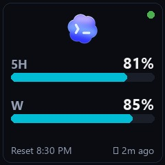
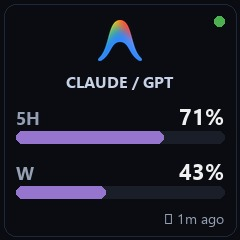
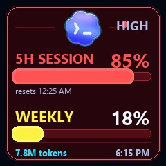
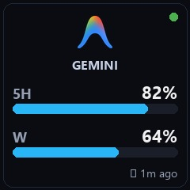
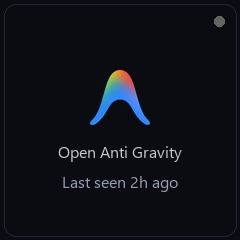

# Mini Display For Codex & Antigravity (Claude / Gemini)

A real-time AI quota usage dashboard and automated monitor for the **Smart Weather Clock Pro Ultra** (240x240 LCD display).

Seamlessly tracks and displays token limits and consumption for **OpenAI Codex** and **Google Antigravity IDE** (with automatic active model detection for **Claude** and **Gemini**).

---

## ✨ Features

- 🔄 **30s Smooth Rotation**: Rotates between Codex usage and Antigravity active model usage every 30 seconds.
- ⚡ **0.5s Logo Splash Transition**: Displays a minimal, clean brand logo for exactly 0.5s before smoothly transitioning to the dashboard screen.
- 🤖 **Real-Time Active Model Detection**: Dynamically inspects Antigravity IDE session logs in real time. When you switch between **Claude Sonnet** and **Gemini**, the clock automatically detects and switches to that model's dedicated quota screen!
- 📊 **0% → 100% Usage Consumption**: Displays consumed quota as intuitive progress bars (from 0% up to 100%).
- 🚨 **Red Alert Theme (80%+ Usage Warning)**: Automatically switches the entire clock UI (background, borders, accent bars) to a vibrant Alert Red when either the 5-Hour or Weekly usage reaches or exceeds 80%.
- ⏱️ **Reset Time Countdown**: Shows reset timestamp (e.g. `Reset 10:45 PM`) and status dots (Green = active, Amber = stale, Gray = offline).
- 🛡️ **Auto-Restart Background Daemon**: PowerShell loop script ensures the monitor runs continuously in the background without interruptions.

---

## 📸 Screenshots & Previews

| Codex Dashboard (Normal) | Antigravity Claude Sonnet | 80%+ Critical Red Alert |
| :---: | :---: | :---: |
|  |  |  |

| Antigravity Gemini | Smooth Logo Splash | Offline Status |
| :---: | :---: | :---: |
|  |  |  |

---

## 📁 Repository Structure

```
Mini-Display-For-Codex-Antigravity-Claude/
├── assets/                          # Brand logos and high-resolution screen previews
│   ├── codex_logo.png
│   ├── antigravity_logo.png
│   ├── preview_codex_240.jpg
│   ├── preview_antigravity_claude_240.jpg
│   ├── preview_antigravity_gemini_240.jpg
│   └── codex_usage_red_preview.jpg
├── docs/                            # Hardware user manuals and video guides
│   ├── Video tutorials +Manual.docx
│   ├── time always 00_00 1970.docx
│   └── 동영상 튜토리얼+스마트 시계 사용 설명서.docx
├── firmware/                        # Clock firmware update binary
│   └── SDPro_V1.0.6_20260525_174828.bin
├── codex_limit_clock.py             # Main controller, quota fetcher, image renderer & uploader
├── start_codex_limit_clock.ps1      # Background auto-restart runner script
├── .gitignore
└── README.md
```

---

## 🚀 Getting Started

### 1. Prerequisites
- Python 3.10+
- Install required packages:
  ```bash
  pip install Pillow grpcio protobuf
  ```
- Smart Weather Clock connected to the same local WiFi network (Default IP: `192.168.0.58`).

### 2. Running Manually
Run a single refresh or continuous loop:
```bash
# Continuous 30-second loop with automatic model detection
python codex_limit_clock.py --loop 30 --clock-ip 192.168.0.58

# Show both Gemini and Claude screens in rotation
python codex_limit_clock.py --loop 30 --ag-model both
```

### 3. Running as Background Service (Windows)
To keep the script running permanently in the background:
```powershell
.\start_codex_limit_clock.ps1
```

---

## ⚙️ Configuration Options

| Flag | Default | Description |
| :--- | :--- | :--- |
| `--clock-ip` | `192.168.0.58` | IP address of your Smart Weather Clock |
| `--loop` | `30` | Refresh and screen rotation interval in seconds (0 = run once) |
| `--ag-model` | `auto` | `auto` (detect active IDE model), `gemini`, `claude`, or `both` |
| `--no-splash` | `False` | Disable the 0.5s logo splash transition |
| `--no-configure` | `False` | Upload images only; skip switching clock to Photo mode |

---

## 📄 Documentation & Firmware
- Manuals and setup guides can be found in the [`docs/`](docs/) folder.
- Firmware update binary is available in [`firmware/`](firmware/).

---

## 👤 Author
**Mohammed Shakib**  
- GitHub: [@MohammedShakib](https://github.com/MohammedShakib)
