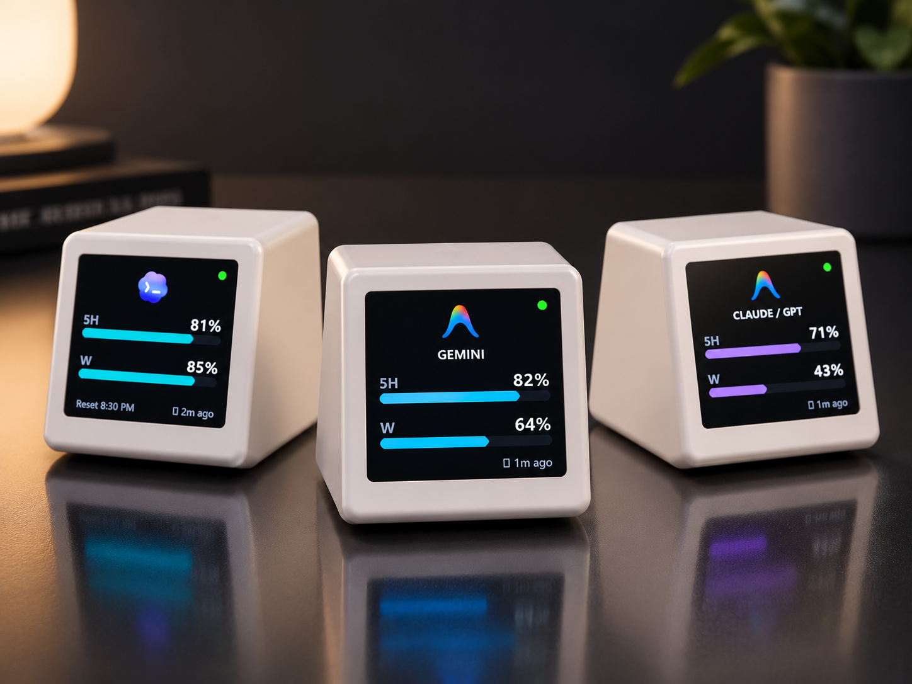
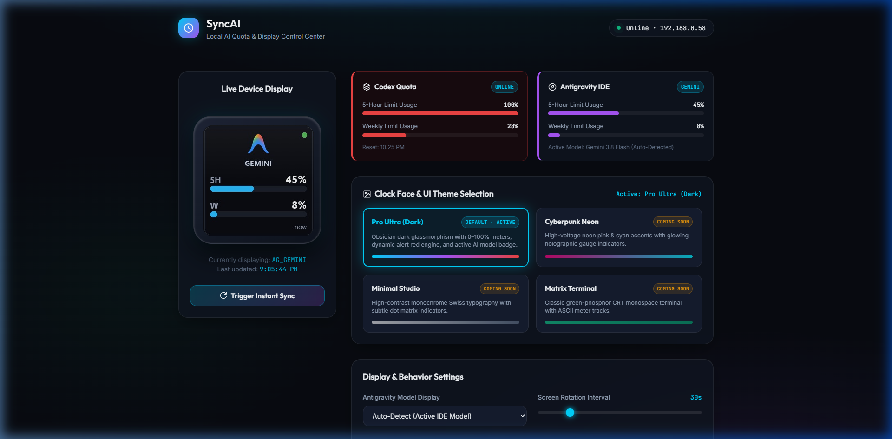
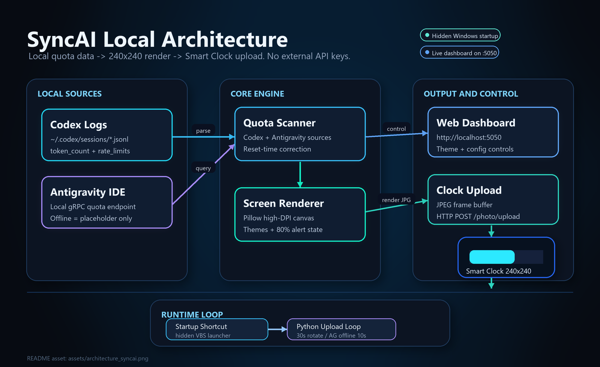
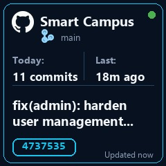

<div align="center">


# SyncAI AI Quota Display
### Mini Display Dashboard for Codex, Antigravity, GitHub & Claude/GPT

**Real-time local AI quota and GitHub activity tracking on a 240×240 Wi-Fi display — no paid AI API keys required.**

[](https://www.python.org/)
[](https://www.microsoft.com/windows)
[](http://localhost:5050)
[](#data-sources--security)
[](#hardware--clock-setup)

<br/>



<br/>
<br/>



</div>

---

## 📖 Table of Contents

- [Overview](#-overview)
- [Architecture & How It Works](#-architecture--how-it-works)
- [Display Showcase & Themes](#-display-showcase--themes)
- [Key Features](#-key-features)
- [Prerequisites](#-prerequisites)
- [Quick Start](#-quick-start)
- [Web Control Dashboard](#-web-control-dashboard)
- [Configuration Guide (`config.json`)](#-configuration-guide-configjson)
- [Data Sources & Security](#data-sources--security)
- [Windows Background Service & Auto-Start](#-windows-background-service--auto-start)
- [Hardware & Clock Setup](#-hardware--clock-setup)
- [Project File Structure](#-project-file-structure)
- [Troubleshooting & Diagnostics](#-troubleshooting--diagnostics)
- [License](#-license)

---

## 🌟 Overview

**SyncAI AI Quota Display** connects your local AI developer workflow directly to a physical 240×240 Wi-Fi display sitting on your desk. It continuously monitors your active AI rate limits without needing any paid OpenAI or Google Cloud API tokens, and can optionally show your GitHub project activity:

- **OpenAI Codex**: Tracks 5-hour rolling session limits, weekly limits, and countdown to reset.
- **Google Antigravity IDE**: Live quota metrics and reset timestamps for both **Gemini** and **Claude / GPT** models extracted directly via the IDE's local gRPC server.
- **GitHub Activity**: Tracks recent repository activity, today's commits, latest SHA/message, branch, push time, and open pull request count using local Git plus the GitHub API.
- **Smart Rotation & Alerting**: Rotates between displays, auto-detects whichever model you are actively using, and triggers a high-visibility warning theme whenever usage exceeds your alert threshold (default: 80%).

---

## ⚡ Architecture & How It Works

<p align="center">
  
</p>

1. **Zero External AI API Cost**: Queries local AI artifacts already running on your machine. GitHub activity works with public data by default and can use an optional read-only GitHub token for private repositories.
2. **Deterministic Refresh**: Renders crisp 240×240 JPEGs with antialiasing and sub-pixel glyph rendering.
3. **Instant Network Delivery**: Transmits rendered frames directly over your local Wi-Fi to the clock's built-in photo display server.

---

## 🎨 Display Showcase & Themes

SyncAI includes meticulously designed 240×240 UI themes tailored specifically for small round/square IPS displays with high contrast and readability from across your desk:

| **OpenAI Codex (Default)** | **Antigravity: Gemini** | **Antigravity: Claude** |
| :---: | :---: | :---: |
|  |  |  |
| *5-Hour & Weekly meters with reset time* | *Real-time Gemini quota tracking* | *Real-time Claude / GPT quota tracking* |

| **GitHub Activity** | **Warning Alert State (>80%)** | **Graceful Offline State** |
| :---: | :---: | :---: |
|  |  |  |
| *Commits, latest push, branch, and SHA* | *Auto-switches to red warning palette* | *Prompts to open IDE; reverts in 10s* |

---

## ✨ Key Features

- 🔒 **No Paid AI API Keys & Privacy-First Defaults**  
  No OpenAI API key, no Google Cloud project, and no credit card required. SyncAI inspects local session JSONL logs and queries the local Antigravity Language Server via local loopback gRPC (`127.0.0.1`). GitHub integration can run from public data, with an optional read-only token for private repository activity.
- 🤖 **Intelligent Active Model Auto-Detection**  
  Automatically identifies whether you are prompting Gemini or Claude/GPT in Antigravity IDE by reading the active transcript change-events. The clock switches dynamically to the model you are actually using.
- 🕒 **Stale Reset Recovery**  
  If a 5-hour or weekly reset timestamp has expired while Codex or the IDE was closed, SyncAI automatically corrects stale 100% percentages back to 0% rather than displaying outdated data.
- 🧊 **Frozen Last-Known Antigravity View**  
  When Antigravity IDE is closed but previous quota data exists, SyncAI shows a muted `LAST KNOWN` screen with cached 5H/Weekly values instead of pretending the data is live.
- 🚨 **Configurable Alert Warning Thresholds**  
  Set your alert limit (default `80%`). As soon as your 5H or Weekly limit hits the threshold, the display shifts into an unmistakable neon crimson warning theme.
- 🌐 **Modern Glassmorphism Web Dashboard**  
  Control everything from your browser at `http://localhost:5050`. Features live screen mirroring, one-click manual sync, rotation sliders, model selectors, and instant theme switching.
- 🧭 **GitHub Project Activity**  
  Adds repository activity to the clock rotation without changing your AI quota screens. SyncAI detects active local GitHub repos from common `projects` folders and supplements them with GitHub API data for pushes, commits, branches, latest SHA/message, and open PR count.
- 🔀 **Dual Visual Themes**  
  Choose between the clean, ultra-readable **Default Obsidian** theme or the futuristic **Orbital Rings** concentric dual-arc theme.
- 🥷 **Stealth Windows Background Service**  
  Includes silent launchers (`.vbs` + `.ps1`) that run seamlessly in the background with zero visible console windows and Windows Named Mutex protection against duplicate processes.

---

## 📦 Prerequisites

- **OS**: Windows 10 or Windows 11 (x64)
- **Python**: Python 3.10 or higher
- **Local Tools**:
  - OpenAI Codex CLI or extension installed and logged in locally
  - [Google Antigravity IDE](https://antigravity.google/) (installed and running)
  - Git installed locally for repository detection
  - Optional: a read-only GitHub fine-grained personal access token for private repository activity
- **Hardware**: ESP8266 / ESP32-based 240×240 Smart Weather Clock connected to the same Wi-Fi router.

---

## 🚀 Quick Start

### 1. Clone & Install Dependencies

```powershell
git clone https://github.com/MohammedShakib/Mini-Display-For-Codex-Antigravity-Claude.git "SyncAI-Quota-Display"
cd "SyncAI-Quota-Display"

python -m pip install -r requirements.txt
```

### 2. Configure Clock IP

Open `config.json` and set your clock's local Wi-Fi IP address:

```json
{
  "clock_ip": "192.168.0.58",
  "rotation_interval": 30,
  "ag_model_mode": "auto",
  "alert_threshold": 80,
  "show_splash": true,
  "selected_theme": "default",
  "codex_ping_enabled": true,
  "codex_ping_interval_minutes": 30
}
```

> [!TIP]
> Not sure what IP your clock has? Check your router's client list or the clock's initial setup screen at `http://192.168.4.1/`.

### 3. Optional: Enable Private GitHub Activity

Public GitHub activity works without a token. To include private repositories you own or can read, create a fine-grained GitHub personal access token with read-only repository access:

- **Repository access**: All repositories, or only the repositories you want on the display.
- **Repository permissions**: `Contents: Read-only`.
- **Optional repository permissions**: `Pull requests: Read-only` if you want open PR counts for private repositories.

Store the token as a Windows user environment variable. Do not put it in `config.json`, README files, screenshots, or commit history.

```powershell
$secure = Read-Host "Paste GitHub token" -AsSecureString
$bstr = [Runtime.InteropServices.Marshal]::SecureStringToBSTR($secure)

try {
  $plain = [Runtime.InteropServices.Marshal]::PtrToStringBSTR($bstr)
  [Environment]::SetEnvironmentVariable("SYNCAI_GITHUB_TOKEN", $plain, "User")
  $env:SYNCAI_GITHUB_TOKEN = $plain
  python -c "import codex_limit_clock as c; print('token_present=', bool(c.github_api_token())); print('github_user=', c.github_api_json('/user').get('login'))"
}
finally {
  if ($bstr -ne [IntPtr]::Zero) {
    [Runtime.InteropServices.Marshal]::ZeroFreeBSTR($bstr)
  }
  Remove-Variable plain -ErrorAction SilentlyContinue
  Remove-Variable secure -ErrorAction SilentlyContinue
}
```

Expected verification:

```text
token_present= True
github_user= YOUR_GITHUB_USERNAME
```

### 4. Run a Single Test Upload

Verify your clock connection and rendering:

```powershell
python .\codex_limit_clock.py --clock-ip 192.168.0.58 --loop 0
```

### 5. Start the Continuous Loop

```powershell
python .\codex_limit_clock.py --clock-ip 192.168.0.58 --loop 30
```

### 6. Launch the Web Dashboard

In a separate terminal (or run as background service):

```powershell
python .\web_server.py
```

Open your browser at **[http://localhost:5050](http://localhost:5050)**.

---

## 🎛️ Web Control Dashboard

The included web server provides a real-time command center:

- **Live Mirroring**: Displays the exact image currently visible on your physical clock, updated in real-time.
- **Immediate Sync**: Press **"Trigger Instant Sync"** to immediately re-scrape quotas and refresh the physical display.
- **Live Sliders & Hot Reload**: Changes to rotation intervals (10s–120s), alert threshold (50%–95%), model display modes, and theme selections take effect immediately without restarting the script.

```
URL: http://localhost:5050
Local Backend: web_server.py (Flask)
Frontend: web/index.html (Vanilla JS, Glassmorphism CSS, Responsive)
```

---

## ⚙️ Configuration Guide (`config.json`)

The running loop hot-reloads `config.json` automatically on every iteration.

| Key | Type | Default | Description |
| :--- | :---: | :---: | :--- |
| `clock_ip` | `string` | `"192.168.0.58"` | The LAN IP address of your 240×240 Wi-Fi display. |
| `rotation_interval` | `integer` | `30` | Duration (in seconds) each screen remains visible before cycling. |
| `ag_model_mode` | `string` | `"auto"` | Model filter: `"auto"` (active model), `"gemini"`, `"claude"`, or `"both"`. |
| `alert_threshold` | `number` | `80` | Quota percentage that triggers the crimson warning UI theme. |
| `show_splash` | `boolean` | `true` | Shows a clean 1-second brand logo transition between rotations. |
| `selected_theme` | `string` | `"default"` | Visual theme ID: `"default"` (Obsidian cards) or `"orbital"` (Dual Neon Rings). |
| `codex_ping_enabled` | `boolean` | `true` | Runs a tiny periodic Codex prompt so this PC receives a fresh account-level quota snapshot. |
| `codex_ping_interval_minutes` | `integer` | `30` | Minimum minutes between Codex quota pings. Each ping consumes a small amount of Codex quota. |
| `github_enabled` | `boolean` | `true` | Enables the GitHub activity screen in the rotation. |
| `github_display_seconds` | `integer` | `15` | Duration the GitHub screen remains visible. |
| `github_refresh_interval_minutes` | `integer` | `1` | Minimum minutes between GitHub status refreshes. |
| `github_repo` | `string` | `""` | Optional fixed repo in `owner/name` form. Leave empty to auto-detect recent local/GitHub activity. |
| `github_branch` | `string` | `""` | Optional branch override. Leave empty to use detected branch or `main`. |
| `github_label` | `string` | `""` | Optional short display label for the GitHub screen. |
| `github_activity_enabled` | `boolean` | `true` | Allows account-level GitHub event lookup in addition to local repo scanning. |
| `github_user` | `string` | `""` | Optional GitHub username override. Leave empty to infer it from the detected repo owner. |

---

## Data Sources & Security

SyncAI is designed to keep secrets out of the repository and out of generated runtime state.

### Codex

- Reads local Codex JSONL session files under `~/.codex/sessions`.
- Uses a tiny optional Codex CLI ping to refresh local rate-limit snapshots.
- Does not require an OpenAI API key.

### Antigravity

- Reads live quota data from the local Antigravity IDE language server on `127.0.0.1`.
- Falls back to Windows UI Automation only when the IDE settings page is visible.
- CSRF tokens are discovered from local process command lines only for the local gRPC call and are not saved to runtime state.

### GitHub

- Scans local Git repositories from active editor roots and common project folders such as `D:\Projects`, `D:\projects`, `%USERPROFILE%\Projects`, and `%USERPROFILE%\projects`.
- Reads public GitHub activity without a token.
- Uses `SYNCAI_GITHUB_TOKEN` when present, falling back to `GITHUB_TOKEN` if set.
- The token is sent only as an `Authorization: Bearer ...` header to `https://api.github.com`.
- The token is never written to `config.json`, `runtime/runtime_state.json`, log files, or display images.
- `.env` and `.env.*` are ignored so accidental local token files are not committed.

Fine-grained token guidance:

- Token name: `SyncAI Quota Display`
- Description: `Read-only token for SyncAI Quota Display to fetch GitHub repository activity, commits, branches, pull requests, and recent contribution data for the local mini display dashboard. No write access.`
- Repository access: `All repositories`, or only the repositories you want displayed.
- Required permission: `Contents: Read-only`
- Optional permission: `Pull requests: Read-only`

Scope notes:

- Your own private repositories work when the fine-grained token has access to them.
- Public repositories work through public GitHub API data.
- Private repositories owned by another user or organization require a token that has access to that owner/repository.
- Non-GitHub remotes such as GitLab or Bitbucket are not tracked by the GitHub card.

---

## 🛡️ Windows Background Service & Auto-Start

Run SyncAI completely hidden in the background on login with automatic crash recovery and duplicate process protection.

### Method A: User Startup Shortcut (Recommended, No Admin Rights Needed)

This is the preferred setup for normal Windows users. It starts the hidden VBS launcher after login and avoids visible terminal windows.

```powershell
$Startup = [Environment]::GetFolderPath("Startup")
$ShortcutPath = Join-Path $Startup "SyncAI Quota Display.lnk"
$Shell = New-Object -ComObject WScript.Shell
$Shortcut = $Shell.CreateShortcut($ShortcutPath)
$Shortcut.TargetPath = "wscript.exe"
$Shortcut.Arguments = "`"$PWD\start_codex_limit_clock_hidden.vbs`""
$Shortcut.WorkingDirectory = "$PWD"
$Shortcut.Save()
```

### Method B: Register Windows Scheduled Task (Optional)

Run PowerShell as Administrator or your current user:

```powershell
$Action = New-ScheduledTaskAction -Execute "wscript.exe" -Argument "`"$PWD\start_codex_limit_clock_hidden.vbs`"" -WorkingDirectory "$PWD"
$Trigger = New-ScheduledTaskTrigger -AtLogOn
$Settings = New-ScheduledTaskSettingsSet -AllowStartIfOnBatteries -DontStopIfGoingOnBatteries
Register-ScheduledTask -TaskName "CodexLimitClock" -Action $Action -Trigger $Trigger -Settings $Settings -Force
Start-ScheduledTask -TaskName "CodexLimitClock"
```

If Scheduled Task registration or editing returns `Access is denied`, use Method A. In this local setup the old `CodexLimitClock` task was disabled because it could open a visible PowerShell window if Windows launched it directly.

### Management Commands

Check service status:
```powershell
Get-ScheduledTask -TaskName "CodexLimitClock"
Get-CimInstance Win32_Process | Where-Object { $_.CommandLine -match 'codex_limit_clock.py' }
Get-Content .\runtime\codex_limit_clock.log -Tail 25
```

Cleanly restart background service:
```powershell
Stop-ScheduledTask -TaskName "CodexLimitClock" -ErrorAction SilentlyContinue
Get-CimInstance Win32_Process | Where-Object { $_.CommandLine -match 'codex_limit_clock.py' -or $_.CommandLine -match 'start_codex_limit_clock.ps1' } | ForEach-Object { Stop-Process -Id $_.ProcessId -Force }
wscript.exe ".\start_codex_limit_clock_hidden.vbs"
```

---

## 🔌 Hardware & Clock Setup

The target device is a standard **ESP8266/ESP32 240×240 Smart Weather Clock**:

1. **Initial Clock AP Setup**: Connect phone/laptop to the clock's setup hotspot (`http://192.168.4.1/`) and enter your home 2.4 GHz Wi-Fi credentials.
2. **Obtain Clock IP**: Note the IP assigned to the clock by your router (e.g., `192.168.0.58`).
3. **Firmware Endpoints Used**:
   - `POST /photo/upload`: Uploads the newly rendered 240×240 JPEG (`runtime/codex_usage.jpg` locally, `codex_usage.jpg` on the clock).
   - `GET /theme/toggle?id=2&state=1`: Activates the photo viewer theme.
   - `GET /photo/toggle?name=codex_usage.jpg&state=1`: Selects the uploaded image as the active frame.

---

## 📂 Project File Structure

```text
├── codex_limit_clock.py               # Core orchestrator: scrapers, PIL renderer, uploader loop
├── theme_renderer.py                  # 240x240 High-DPI themes
├── web_server.py                      # Local Flask dashboard backend (port 5050)
├── config.json                        # Hot-reloaded runtime configuration
├── requirements.txt                   # Minimal Python dependencies
├── start_codex_limit_clock.ps1        # PowerShell launcher with named mutex locking
├── start_codex_limit_clock_hidden.vbs # Hidden VBS wrapper for Windows startup
│
├── web/
│   └── index.html                     # Web control dashboard UI
│
├── assets/
│   ├── codex_logo.png                 # Codex display logo
│   ├── antigravity_logo.png           # Antigravity display logo
│   ├── syncai_clock_mockup.png        # README branding/product mockup
│   ├── architecture_syncai.png        # README architecture visual
│   ├── web_dashboard_preview.png      # Web dashboard screenshot
│   ├── preview_*_240.jpg              # 240x240 screen previews
│   └── theme_preview_*.jpg            # Theme previews
│
├── runtime/                           # Ignored generated output: logs, state, upload JPGs
├── docs/                              # Factory hardware manuals
├── firmware/                          # Device firmware binaries
└── AGENTS.md                          # Agent/developer operating notes
```

---

## 🔍 Troubleshooting & Diagnostics

### 1. Clock Does Not Update / Photo Upload Fails
- Verify that both your PC and clock are on the exact same Wi-Fi subnet.
- Test connection: `Test-NetConnection 192.168.0.58 -Port 80`
- Check `runtime/codex_limit_clock.log` for HTTP errors or timeouts.

### 2. Codex Quota Appears Stale
- Codex updates session logs when prompts are submitted. Send a message in Codex to trigger a fresh JSONL event.
- If the 5-hour reset time has passed, SyncAI automatically zeros out stale session percentages.

### 3. Antigravity Shows "Open Antigravity IDE"
- The Antigravity IDE language server process (`language_server_windows_x64.exe`) must be active.
- Launch the IDE. The clock will detect the gRPC endpoint and update within the next cycle.
- The offline prompt automatically dismisses after 10 seconds to return to Codex.

### 4. Duplicate Python Loops Running
- Terminate stale loops before restarting:
  ```powershell
  Get-CimInstance Win32_Process | Where-Object { $_.CommandLine -match 'codex_limit_clock.py' } | ForEach-Object { Stop-Process -Id $_.ProcessId -Force }
  ```

### 5. GitHub Shows "No Activity Today"
- Confirm the current runtime state:
  ```powershell
  python -c "import json; s=json.load(open('runtime/runtime_state.json')); print(json.dumps(s.get('github', {}), indent=2))"
  ```
- If private repositories are missing, verify the token is available without printing the token itself:
  ```powershell
  python -c "import codex_limit_clock as c; print('token_present=', bool(c.github_api_token())); print('github_user=', c.github_api_json('/user').get('login'))"
  ```
- If you generated a token after the hidden loop was already running, restart the loop so the process inherits the new environment variable:
  ```powershell
  Get-CimInstance Win32_Process | Where-Object { $_.CommandLine -match 'codex_limit_clock.py' -or $_.CommandLine -match 'start_codex_limit_clock.ps1' } | ForEach-Object { Stop-Process -Id $_.ProcessId -Force }
  wscript.exe ".\start_codex_limit_clock_hidden.vbs"
  ```
- GitHub contribution graphs may show `0` for commits that do not count toward public contributions. SyncAI also checks repository commits and local Git history so pushed repo activity can still appear on the clock.

---

## 📄 License

This project is open source and available under the [MIT License](LICENSE).

<div align="center">
Made with ❤️ for AI developers who want their quotas visible at a glance.
</div>
